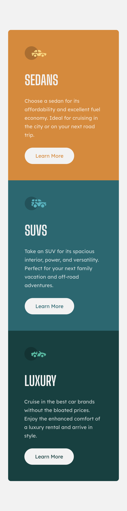
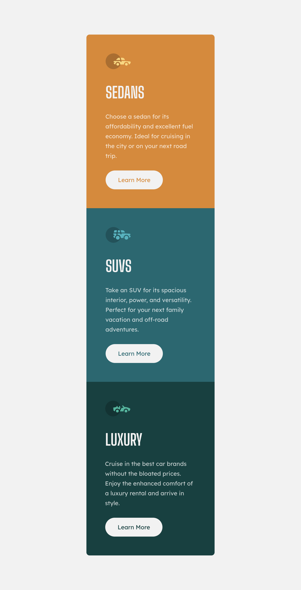
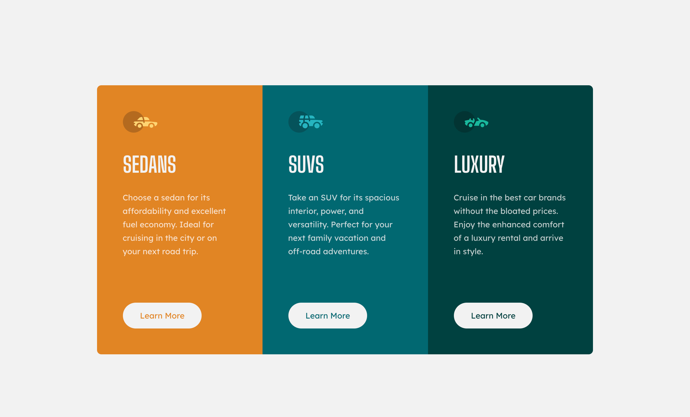

# Frontend Mentor - 3 Column preview card component solution

This is a solution to the [3 Column preview card component challenge on Frontend Mentor](https://www.frontendmentor.io/challenges/3column-preview-card-component-pH92eAR2-).

## Table of contents

- [Overview](#overview)
  - [The challenge](#the-challenge)
  - [Screenshots](#screenshot)
- [Built with](#built-with)
- [Key Features](#key-features)
- [Links](#links)

## Overview

### The challenge

Users should be able to:

- ✅ View the optimal layout depending on their device's screen size
- ✅ See hover states for interactive elements

### Screenshot

| Mobile Preview                | Tablet Preview                | Desktop Preview                |
| ----------------------------- | ----------------------------- | ------------------------------ |
|  |  |  |

## Built with

## Key Features

- 📱 Semantic HTML5 markup
- 🎨 Mobile-first responsive design
- 🔍 Proper SEO setup with metadata
- 📏 Pixel-perfect implementation

### Links

- Solution URL: [Frontend Mentor ↗](https://your-solution-url.com)
- Live Site URL: [Open on Vercel ↗](https://your-live-site-url.com)
